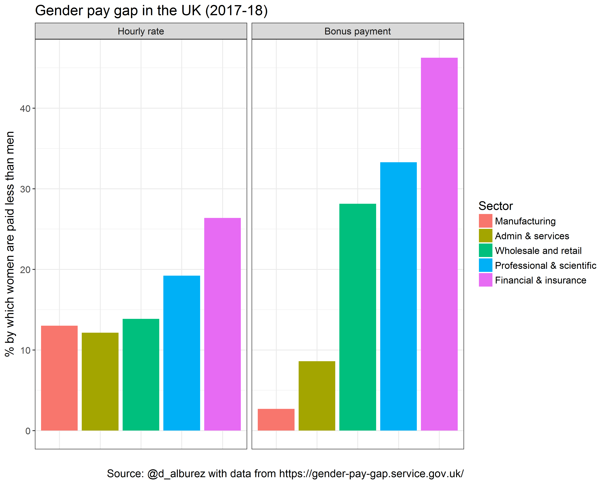

# Gender pay gap in the UK (2017-18)

The repository contains data and minimalistic code to reproduce reproduce the gender pay gap of the 5 most important industries in the UK. Data come from official statistics published by the [UK Gender Pay Gap Services](https://gender-pay-gap.service.gov.uk/).

